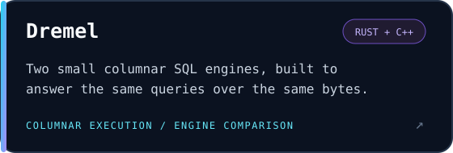
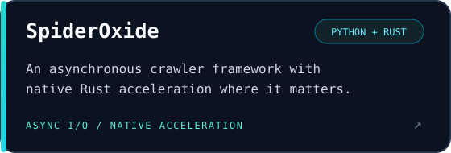
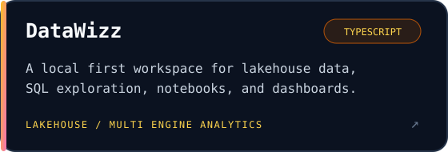
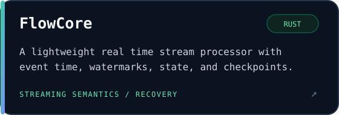

  

  
  
  

## `whoami`

I'm **Rohan Dubey**, a Staff Data Engineer. I work where distributed systems, real time data, and performance engineering meet. I turn difficult infrastructure problems into platforms that are fast, resilient, and pleasant to operate.

I am especially interested in **stream processing semantics**, **columnar query execution**, **data intensive systems**, and using **Rust, Go, Java, and Python** to explore the tradeoffs behind them.

> I like systems that stay boring under pressure: observable, recoverable, and predictably fast.

## Selected engineering

  
  

  
  

## The problems I enjoy

| Area | What I care about |
| --- | --- |
| **Streaming systems** | Event time, watermarks, state, backpressure, checkpoints, and recovery |
| **Query engines** | Columnar formats, vectorized execution, memory layout, and benchmarking |
| **Distributed data** | Partitioning, consistency, fault tolerance, lakehouse architecture, and observability |
| **Platform engineering** | Kubernetes native workloads, infrastructure as code, automation, and developer experience |

## Data and systems stack

| Layer | Technologies |
| --- | --- |
| **Streaming and messaging** | Apache Kafka, Apache Flink, Spark Structured Streaming, Apache Pulsar, Kafka Streams, RabbitMQ, NATS |
| **Compute and processing** | Apache Spark, Apache Flink, Ray, Apache Hadoop, DataFusion |
| **Query and analytics** | Trino, Presto, ClickHouse, Dremio, Apache Druid, Apache Pinot, DuckDB |
| **Lakehouse and formats** | Apache Iceberg, Delta Lake, Apache Hudi, Apache Arrow, Parquet, MinIO |
| **Databases and search** | PostgreSQL, Cassandra, ScyllaDB, CockroachDB, TiDB, MongoDB, Redis, Elasticsearch |
| **Platform and orchestration** | Kubernetes, Docker, Terraform, Apache Airflow, Argo, Prometheus, Grafana |
| **Cloud data platforms** | AWS, Snowflake, BigQuery, Databricks |

  

  <code>Spark</code>&nbsp;&nbsp;·&nbsp;&nbsp;<code>Flink</code>&nbsp;&nbsp;·&nbsp;&nbsp;<code>Kafka</code>&nbsp;&nbsp;·&nbsp;&nbsp;<code>Arrow</code>&nbsp;&nbsp;·&nbsp;&nbsp;<code>DataFusion</code>&nbsp;&nbsp;·&nbsp;&nbsp;<code>Iceberg</code>&nbsp;&nbsp;·&nbsp;&nbsp;<code>ClickHouse</code>&nbsp;&nbsp;·&nbsp;&nbsp;<code>gRPC</code>

## Open source

Open source is a big part of how I learn and work. I enjoy reading real implementations, reproducing ideas in focused projects, reporting issues, and contributing fixes or improvements when I find something useful. Most of my exploration happens around data engines, streaming systems, storage, databases, and Rust infrastructure.

I like the feedback loop that open source creates. Ideas are discussed in public, designs are tested against real workloads, and improvements can benefit an entire engineering community.

  
  

## GitHub stats

  
  

### Contribution streak

  

## Contribution signal

  

  Open to conversations about distributed systems, data infrastructure, query engines, and performance engineering.

  <a href="mailto:rohankumardubey497@gmail.com"><strong>Start a conversation →</strong></a>

